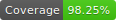

# React Create Portal

[](https://travis-ci.org/levinqdl/react-create-portal)
[](https://badge.fury.io/js/react-create-portal)


Render elements through a Portal, give you more control over your UI, e.g. rendering a button into footer inside your deeply nested component

## Principles

- Declarative
- Start quickly
- Reasonable
- Test friendly

## Prerequisites

- New React Context API
- ReactDOM Portal

## Get Started

```bash
npm install react-create-portal
```

or

```bash
yarn add react-create-portal
```

## Examples

1. render different contents based on current route

```javascript
// App.js
import React from "react"
import { PortalProvider, createPortal } from "react-create-portal"

const [
  Slot, // place Slot at where elements render
  Render, // Render's children will be portaled into Slot
] = createPortal()

const App = () => (
  <PortalProvider>
    <div>
      Hello <Slot />!
    </div>
    <Router>
      <Route path="/world">
        <Render>World</Render>
      </Route>
      <Route path="/react">
        <Render>React</Render>
      </Route>
    </Router>
  </PortalProvider>
)

/** output dom
 * <div>Hello World!</div> // /world renders "Hello World!"
 * <div>Hello React!</div> // /react renders "Hello React!"
 */
```

2. fallback UI when no Render rendered

```javascript
// App.js
const App = () => (
  <PortalProvider>
    <div>
      Hello <Slot fallback="World" />!
    </div>
    <Router>
      <Route path="/world">
        <div>World Page</div>
      </Route>
      <Route path="/web">
        <div>Web Page</div>
      </Route>
      <Route path="/react">
        <Render>React</Render>
      </Route>
    </Router>
  </PortalProvider>
)

/** output dom
 * <div>Hello World!</div> // /world renders "Hello World!"
 * <div>Hello World!</div> // /web renders "Hello World!"
 * <div>Hello React!</div> // /react renders "Hello React!"
 */
```

## Todos

- [x] bundler
- [x] static type
- [x] test
- [x] PortalProvider
- [x] createPortal
- [x] CI
- [ ] Breadcrumbs
- [ ] docs
- [x] examples
- [ ] publish
